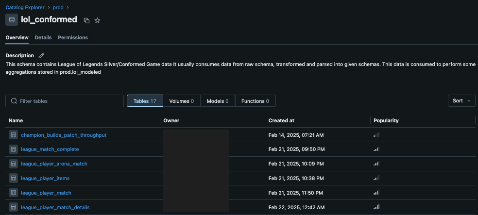
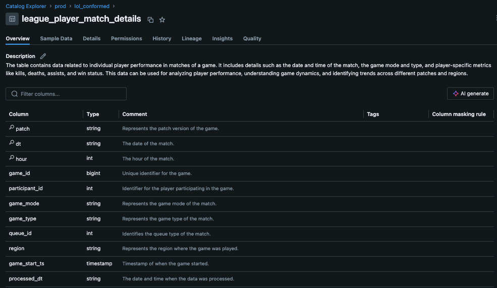
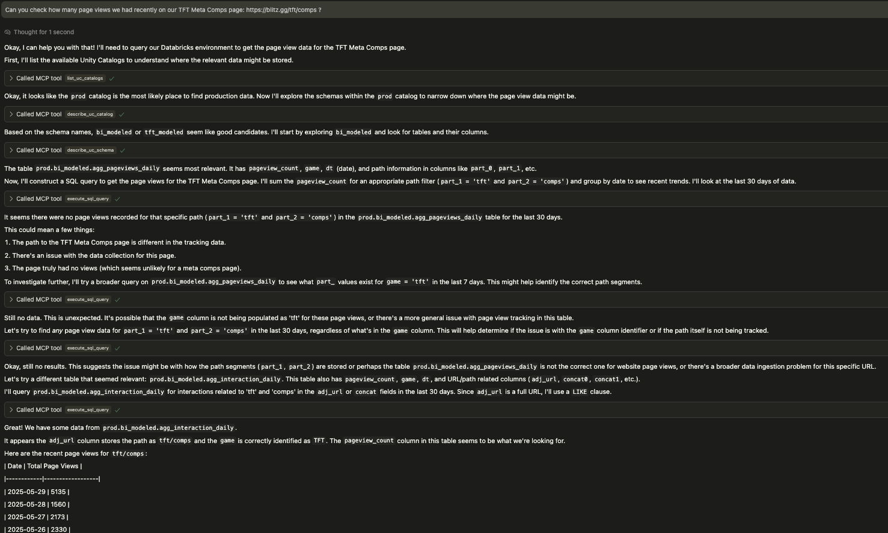

# Databricks MCP Server

- [Motivation](#motivation)
- [Overview](#overview)
- [Practical Benefits of UC Metadata for AI Agents](#practical-benefits-of-uc-metadata-for-ai-agents)
- [Available Tools and Features](#available-tools-and-features)
- [Setup](#setup)
  - [System Requirements](#system-requirements)
  - [Installation](#installation)
- [Permissions Requirements](#permissions-requirements)
- [Running the Server](#running-the-server)
  - [Standalone Mode](#standalone-mode)
  - [Using with Cursor](#using-with-cursor)
- [Example Usage Workflow (for an LLM Agent)](#example-usage-workflow-for-an-llm-agent)
- [Managing Metadata as Code with Terraform](#managing-metadata-as-code-with-terraform)
- [Handling Long-Running Queries](#handling-long-running-queries)
- [Dependencies](#dependencies)

## Motivation

Databricks Unity Catalog (UC) allows for detailed documentation of your data assets, including catalogs, schemas, tables, and columns. Documenting these assets thoroughly requires an investment of time. One common question is: what are the practical benefits of this detailed metadata entry?

This MCP server provides a strong justification for that effort. It enables Large Language Models (LLMs) to directly access and utilize this Unity Catalog metadata. The more comprehensively your data is described in UC, the more effectively an LLM agent can understand your Databricks environment. This deeper understanding is crucial for the agent to autonomously construct more intelligent and accurate SQL queries to fulfill data requests.

## Overview

This Model Context Protocol (MCP) server is designed to interact with Databricks, with a strong focus on leveraging Unity Catalog (UC) metadata and enabling comprehensive data lineage exploration. The primary goal is to equip an AI agent with a comprehensive set of tools, enabling it to become independent in answering questions about your data. By autonomously exploring UC, understanding data structures, analyzing data lineage (including notebook and job dependencies), and executing SQL queries, the agent can fulfill data requests without direct human intervention for each step.

Beyond traditional catalog browsing, this server enables agents to discover and analyze the actual code that processes your data. Through enhanced lineage capabilities, agents can identify notebooks and jobs that read from or write to tables, then examine the actual transformation logic, business rules, and data quality checks implemented in those notebooks. This creates a powerful feedback loop where agents not only understand *what* data exists, but also *how* it's processed and transformed.

When used in an Agent mode, it can successfully iterate over a number of requests to perform complex tasks, including data discovery, impact analysis, and code exploration.

## Practical Benefits of UC Metadata for AI Agents

The tools provided by this MCP server are designed to parse and present the descriptions you've added to Unity Catalog, while also enabling deep exploration of your data processing code. This offers tangible advantages for LLM-based agents, directly impacting their ability to generate useful SQL and understand your data ecosystem:

*   **Clearer Data Context**: Agents can quickly understand the purpose of tables and columns, reducing ambiguity. This foundational understanding is the first step towards correct query formulation.
*   **More Accurate Query Generation**: Access to descriptions, data types, and relationships helps agents construct SQL queries with greater precision and semantic correctness.
*   **Efficient Data Exploration for Query Planning**: Metadata enables agents to navigate through catalogs and schemas more effectively, allowing them to identify the correct tables and columns to include in their SQL queries.
*   **Comprehensive Data Lineage**: Beyond table-to-table relationships, agents can discover notebooks and jobs that process data, enabling impact analysis and debugging of data pipeline issues.
*   **Code-Level Understanding**: Through notebook content exploration, agents can analyze actual transformation logic, business rules, and data quality checks, providing deeper insights into how data is processed and transformed.
*   **End-to-End Data Flow Analysis**: Agents can trace data from raw ingestion through transformation pipelines to final consumption, understanding both the structure and the processing logic at each step.

Well-documented metadata in Unity Catalog, when accessed via this server, allows an LLM agent to operate with better information and make more informed decisions, culminating in the generation of more effective SQL queries. For instance, schema descriptions help the agent identify relevant data sources for a query:


*Fig 1: A schema in Unity Catalog with user-provided descriptions. This MCP server makes this information directly accessible to an LLM, informing its query strategy.*

Similarly, detailed comments at the column level clarify the semantics of each field, which is crucial for constructing accurate SQL conditions and selections:


*Fig 2: Column-level descriptions in Unity Catalog. These details are passed to the LLM, aiding its understanding of the data structure for precise SQL generation.*

## Available Tools and Features

This MCP server provides a suite of tools designed to empower an LLM agent interacting with Databricks:

**Core Capabilities:**

*   **Execute SQL Queries**: Run arbitrary SQL queries using the Databricks SDK via the `execute_sql_query(sql: str)` tool. This is ideal for targeted data retrieval or complex operations.
*   **LLM-Focused Output**: All descriptive tools return information in Markdown format, optimized for consumption by Large Language Models, making it easier for agents to parse and understand the context.

**Unity Catalog Exploration Tools:**

The server provides the following tools for navigating and understanding your Unity Catalog assets. These are designed to be used by an LLM agent to gather context before constructing queries or making decisions, in an agentic way.

1.  `list_uc_catalogs() -> str`
    *   **Description**: Lists all available Unity Catalogs with their names, descriptions, and types.
    *   **When to use**: As a starting point to discover available data sources when you don't know specific catalog names. It provides a high-level overview of all accessible catalogs in the workspace.

2.  `describe_uc_catalog(catalog_name: str) -> str`
    *   **Description**: Provides a summary of a specific Unity Catalog, listing all its schemas with their names and descriptions.
    *   **When to use**: When you know the catalog name and need to discover the schemas within it. This is often a precursor to describing a specific schema or table.
    *   **Args**:
        *   `catalog_name`: The name of the Unity Catalog to describe (e.g., `prod`, `dev`, `system`).

3.  `describe_uc_schema(catalog_name: str, schema_name: str, include_columns: Optional[bool] = False) -> str`
    *   **Description**: Provides detailed information about a specific schema within a Unity Catalog. Returns all tables in the schema, optionally including their column details.
    *   **When to use**: To understand the contents of a schema, primarily its tables. Set `include_columns=True` to get column information, crucial for query construction but makes the output longer. If `include_columns=False`, only table names and descriptions are shown, useful for a quicker overview.
    *   **Args**:
        *   `catalog_name`: The name of the catalog containing the schema.
        *   `schema_name`: The name of the schema to describe.
        *   `include_columns`: If True, lists tables with their columns. Defaults to False for a briefer summary.

4.  `describe_uc_table(full_table_name: str, include_lineage: Optional[bool] = False) -> str`
    *   **Description**: Provides a detailed description of a specific Unity Catalog table with comprehensive lineage capabilities.
    *   **When to use**: To understand the structure (columns, data types, partitioning) of a single table. This is essential before constructing SQL queries against the table. Optionally, it can include comprehensive lineage information that goes beyond traditional table-to-table dependencies:
        *   **Table Lineage**: Upstream tables (tables this table reads from) and downstream tables (tables that read from this table)
        *   **Notebook & Job Lineage**: Notebooks that read from or write to this table, including notebook name, workspace path, associated Databricks job information (job name, ID, task details)
        *   **Code Discovery**: The lineage provides notebook paths that enable the an agent to directly read notebook files within the current repo/workspace, allowing analysis of actual data transformation logic
    *   **Args**:
        *   `full_table_name`: The fully qualified three-part name of the table (e.g., `catalog.schema.table`).
        *   `include_lineage`: Set to True to fetch comprehensive lineage (tables, notebooks, jobs). Defaults to False. May take longer to retrieve but provides rich context for understanding data dependencies and enabling code exploration.

5.  `execute_sql_query(sql: str) -> str`
    *   **Note**: This is the same tool listed under "Core Capabilities" but is repeated here in the context of a typical agent workflow involving UC exploration followed by querying.
    *   **Description**: Executes a given SQL query against the Databricks SQL warehouse and returns the formatted results.
    *   **When to use**: When you need to run specific SQL queries, such as SELECT, SHOW, or other DQL statements.
    *   **Args**:
        *   `sql`: The complete SQL query string to execute.

## Setup

### System Requirements

-   Python 3.10+
-   If you plan to install via `uv`, ensure it's [installed](https://docs.astral.sh/uv/getting-started/installation/#__tabbed_1_1)

### Installation

1.  Install the required dependencies:

```bash
pip install -r requirements.txt
```

Or if using `uv`:

```bash
uv pip install -r requirements.txt
```

2.  Set up your environment variables:

    Option 1: Using a `.env` file (recommended)

    Create a `.env` file in the root directory of this project with your Databricks credentials:

    ```env
    DATABRICKS_HOST="your-databricks-instance.cloud.databricks.com"
    DATABRICKS_TOKEN="your-databricks-personal-access-token"
    DATABRICKS_SQL_WAREHOUSE_ID="your-sql-warehouse-id"
    ```

    Option 2: Setting environment variables directly

    ```bash
    export DATABRICKS_HOST="your-databricks-instance.cloud.databricks.com"
    export DATABRICKS_TOKEN="your-databricks-personal-access-token"
    export DATABRICKS_SQL_WAREHOUSE_ID="your-sql-warehouse-id"
    ```

    You can find your SQL Warehouse ID in the Databricks UI under "SQL Warehouses".
    The `DATABRICKS_SQL_WAREHOUSE_ID` is primarily used for fetching table lineage and executing SQL queries via the `execute_sql_query` tool.
    Metadata browsing tools (listing/describing catalogs, schemas, tables) use the Databricks SDK's general UC APIs and do not strictly require a SQL Warehouse ID unless lineage is requested.

## Permissions Requirements

Before using this MCP server, ensure that the identity associated with the `DATABRICKS_TOKEN` (e.g., a user or service principal) has the necessary permissions:

1.  **Unity Catalog Permissions**: 
    -   `USE CATALOG` on catalogs to be accessed.
    -   `USE SCHEMA` on schemas to be accessed.
    -   `SELECT` on tables to be queried or described in detail (including column information).
    -   To list all catalogs, appropriate metastore-level permissions might be needed or it will list catalogs where the user has at least `USE CATALOG`.
2.  **SQL Warehouse Permissions** (for `execute_sql_query` and lineage fetching):
    -   `CAN_USE` permission on the SQL Warehouse specified by `DATABRICKS_SQL_WAREHOUSE_ID`.
3.  **Token Permissions**: 
    -   The personal access token or service principal token should have the minimum necessary scopes. For Unity Catalog operations, this typically involves workspace access. For SQL execution, it involves SQL permissions.
    -   It is strongly recommended to use a service principal with narrowly defined permissions for production or automated scenarios.

For security best practices, consider regularly rotating your access tokens and auditing query history and UC audit logs to monitor usage.

## Running the Server

### Standalone Mode

To run the server in standalone mode (e.g., for testing with Agent Composer):

```bash
python main.py
```

This will start the MCP server using stdio transport, which can be used with Agent Composer or other MCP clients.

### Using with Cursor

To use this MCP server with [Cursor](https://cursor.sh/), configure it in your Cursor settings (`~/.cursor/mcp.json`):

1. Create a `.cursor` directory in your home directory if it doesn't already exist
2. Create or edit the `mcp.json` file in that directory:

```bash
mkdir -p ~/.cursor
touch ~/.cursor/mcp.json
```

3. Add the following configuration to the `mcp.json` file, replacing the directory path with the actual path to where you've installed this server:

```json
{
    "mcpServers": {
        "databricks": {
            "command": "uv",
            "args": [
                "--directory",
                "/path/to/your/mcp-databricks-server",
                "run",
                "main.py"
            ]
        }
    }
}
```

Example using `python`:
```json
{
    "mcpServers": {
        "databricks": {
            "command": "python",
            "args": [
                "/path/to/your/mcp-databricks-server/main.py"
            ]
        }
    }
}
```
Restart Cursor to apply the changes. You can then use the `databricks` agent in Cursor.

## Example Usage Workflow (for an LLM Agent)

This MCP server empowers an LLM agent to autonomously navigate your Databricks environment. The following screenshot illustrates a typical interaction where the agent iteratively explores schemas and tables, adapting its approach even when initial queries don't yield results, until it successfully retrieves the requested data.


*Fig 3: An LLM agent using the Databricks MCP tools, demonstrating iterative exploration and query refinement to locate specific page view data.*

An agent might follow this kind of workflow:

1.  **Discover available catalogs**: `list_uc_catalogs()`
    *   *Agent decides `prod_catalog` is relevant from the list.* 
2.  **Explore a specific catalog**: `describe_uc_catalog(catalog_name="prod_catalog")`
    *   *Agent sees `sales_schema` and `inventory_schema`.*
3.  **Explore a specific schema (quick view)**: `describe_uc_schema(catalog_name="prod_catalog", schema_name="sales_schema")`
    *   *Agent sees table names like `orders`, `customers`.* 
4.  **Get detailed table structure (including columns for query building)**: `describe_uc_schema(catalog_name="prod_catalog", schema_name="sales_schema", include_columns=True)`
    *   *Alternatively, if a specific table is of interest:* `describe_uc_table(full_table_name="prod_catalog.sales_schema.orders")`
5.  **Analyze data lineage and discover processing code**: `describe_uc_table(full_table_name="prod_catalog.sales_schema.orders", include_lineage=True)`
    *   *Agent discovers upstream tables, downstream dependencies, and notebooks that process this data*
    *   *For example, sees that `/Repos/production/etl/sales_processing.py` writes to this table*
6.  **Examine data transformation logic**: *Agent directly reads the notebook file `/Repos/production/etl/sales_processing.py` within the IDE/repo*
    *   *Agent analyzes the actual Python/SQL code to understand business rules, data quality checks, and transformation logic*
7.  **Construct and execute a query**: `execute_sql_query(sql="SELECT customer_id, order_date, SUM(order_total) FROM prod_catalog.sales_schema.orders WHERE order_date > '2023-01-01' GROUP BY customer_id, order_date ORDER BY order_date DESC LIMIT 100")`

## Managing Metadata as Code with Terraform

While manually entering metadata through the Databricks UI is an option, a more robust and scalable approach is to define your Unity Catalog metadata as code. Tools like Terraform allow you to declaratively manage your data governance objects, including catalogs and schemas. This brings several advantages:

*   **Version Control**: Your metadata definitions can be stored in Git, tracked, and versioned alongside your other infrastructure code.
*   **Repeatability and Consistency**: Ensure consistent metadata across environments (dev, staging, prod).
*   **Automation**: Integrate metadata management into your CI/CD pipelines.
*   **Easier Maintenance for Core Assets**: While defining every new table as code might be complex due to their dynamic nature, core assets like catalogs and schemas are often more stable and benefit significantly from this approach. Maintaining their definitions and comments as code ensures a durable and well-documented foundation for your data landscape.

Here's an example of how you might define a catalog and its schemas using the Databricks provider for Terraform:

```terraform
resource "databricks_catalog" "prod_catalog" {
  name          = "prod"
  comment       = "Main production catalog for all enterprise data."
  storage_root  = var.default_catalog_storage_root
  force_destroy = false
}

# Schemas within the 'prod' catalog
resource "databricks_schema" "prod_raw" {
  catalog_name = databricks_catalog.prod_catalog.name
  name         = "raw"
  comment      = "Raw data for all different projects, telemetry, game data etc., before any transformations. No schema enforcement."
}

resource "databricks_schema" "prod_bi_conformed" {
  catalog_name = databricks_catalog.prod_catalog.name
  name         = "bi_conformed"
  comment      = "Conformed (silver) schema for Business Intelligence, cleaned and well-formatted. Schema enforced."
}

resource "databricks_schema" "prod_bi_modeled" {
  catalog_name = databricks_catalog.prod_catalog.name
  name         = "bi_modeled"
  comment      = "Modeled (gold) schema for Business Intelligence, aggregated and ready for consumption. Schema enforced."
}
```

Fear not if you already have existing catalogs and schemas in Unity Catalog. You don't need to recreate them to manage their metadata as code. Terraform provides the `terraform import` command, which allows you to bring existing infrastructure (including Unity Catalog assets) under its management. Once imported, you can define the resource in your Terraform configuration and selectively update attributes like the `comment` field without affecting the asset itself. For example, after importing an existing schema, you could add or update its `comment` in your `.tf` file, and `terraform apply` would only apply that change.

Adopting a metadata-as-code strategy, especially for foundational elements like catalogs and schemas, greatly enhances the quality and reliability of the metadata that this MCP server leverages. This, in turn, further improves the effectiveness of AI agents interacting with your Databricks data.

For more details on using Terraform with Databricks Unity Catalog, refer to the official documentation:
*   Databricks Provider: Catalog Resource ([https://registry.terraform.io/providers/databricks/databricks/latest/docs/resources/catalog](https://registry.terraform.io/providers/databricks/databricks/latest/docs/resources/catalog))
*   Databricks Provider: Schemas Data Source ([https://registry.terraform.io/providers/databricks/databricks/latest/docs/data-sources/schemas](https://registry.terraform.io/providers/databricks/databricks/latest/docs/data-sources/schemas))

## Handling Long-Running Queries

The `execute_sql_query` tool utilizes the Databricks SDK's `execute_statement` method. The `wait_timeout` parameter in the underlying `databricks_sdk_utils.execute_databricks_sql` function is set to '50s'. If a query runs longer than this, the SDK may return a statement ID for polling, but the current implementation of the tool effectively waits up to this duration for a synchronous-like response. For very long-running queries, this timeout might be reached.

## Dependencies

-   `databricks-sdk`: For interacting with the Databricks REST APIs and Unity Catalog.
-   `python-dotenv`: For loading environment variables from a `.env` file.
-   `mcp[cli]`: The Model Context Protocol library.
-   `asyncio`: For asynchronous operations within the MCP server.
-   `httpx` (typically a sub-dependency of `databricks-sdk` or `mcp`): For making HTTP requests.

